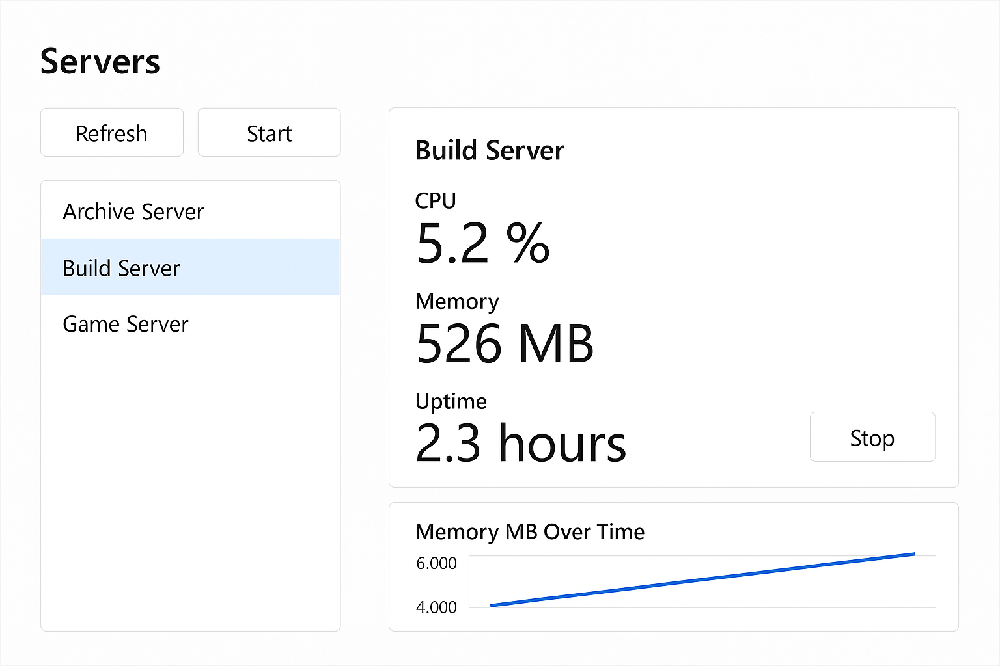
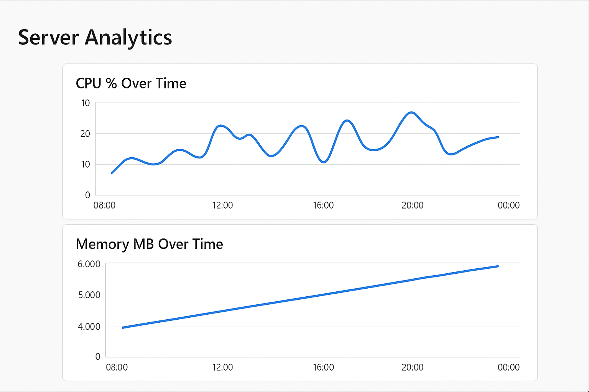

# ⚡ PulsePanel — Windows‑Native, Provenance‑First Server Management

**PulsePanel** is the definitive open‑source, Windows‑native server management panel.  
No paywalls. No feature gating. Every capability unlocked for everyone.

Designed for:
- **Determinism** — predictable, reproducible behaviour.
- **Provenance** — every action logged, every change traceable.
- **Accessibility** — clear UI, dyslexia‑friendly, all‑ages onboarding.

---

## ✨ New in Step 16 — Live Health History

PulsePanel now tracks **CPU %**, **Memory MB**, and **Uptime** over time for each server.

From the **Servers** page, click **View Analytics** to see CPU/Memory trends in real time.

**Highlights:**
- Health data integrated into `ServersViewModel` with provenance logging preserved.
- New `HealthSnapshot` model for rolling history (last 100 entries per server).
- “View Analytics” button in `ServersPage` for quick navigation.
- Ready for upcoming `AnalyticsPage` with charts.

---

## 🖥️ Core Features

- **Windows‑Native** — lightweight, no browser bloat.
- **Blueprint‑Driven** — game‑agnostic install/config templates.
- **Lifecycle Control** — Start/Stop with full provenance logging.
- **Health Monitoring** — live CPU, Memory, Uptime metrics.
- **History Buffer** — rolling snapshots for analytics.
- **Accessibility‑First** — clear typography, logical navigation.

---

## 📸 Screenshots


  


---

## 🚀 Getting Started

1. **Clone the repo**  
   ```bash
   git clone https://github.com/&lt;your-org&gt;/PulsePanel.git
   cd PulsePanel
   ```

2. **Install prerequisites**  
   - Windows 10/11  
   - .NET 6 SDK or later  
   - Windows App Packaging tools

3. **Build & Run**  
   ```bash
   dotnet build
   dotnet run --project src/PulsePanel.App
   ```

---

## 🛠️ Tech Stack

- **WinUI 3** — modern Windows UI framework.
- **.NET 6+** — cross‑platform runtime.
- **MVVM** — clean separation of UI and logic.
- **Dependency Injection** — modular, testable design.

---

## 📜 License

Custom license blending Creative Commons principles with software enforceability:  
- **Attribution‑Locked** — credit must remain intact.  
- **Non‑Commercial** — no resale or monetisation.  
- **Provenance‑Preserving** — derivative works must retain history.

See [`LICENSE.md`](LICENSE.md) for full terms.

---

## 🤝 Contributing

We welcome contributions that:
- Respect the licensing roadmap.
- Preserve provenance and determinism.
- Avoid scope creep and bloat.

Fork, branch, and submit a PR with clear commit messages.

---

## 📈 Roadmap

- [x] Step 16 — Health history tracking.
- [x] AnalyticsPage with live charts.
- [ ] Alert thresholds for CPU/Memory.
- [ ] Blueprint catalog & plugin marketplace.
- [ ] Historical metrics persistence.

---

## 📬 Contact

Maintainer: **Aaron**  
[GitHub Issues](https://github.com/&lt;your-org&gt;/PulsePanel/issues) for bug reports and feature requests.
